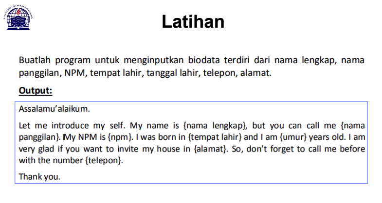
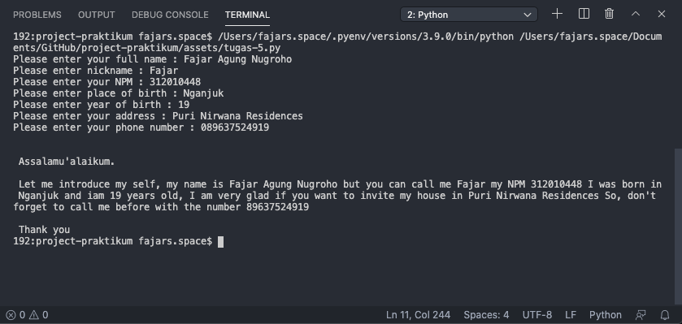
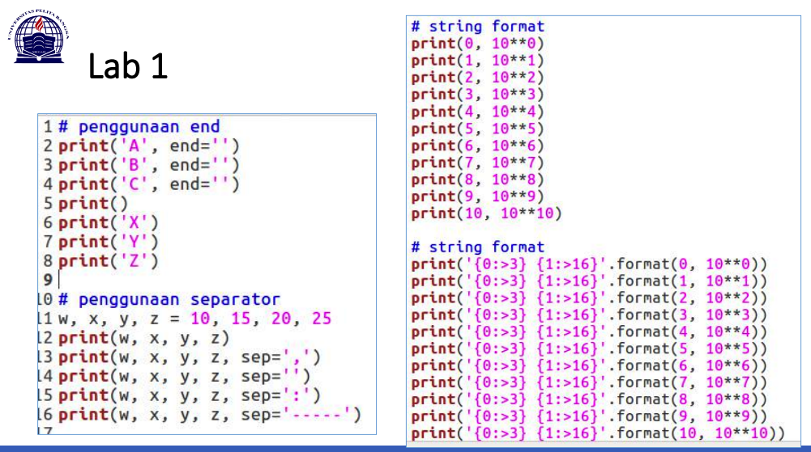
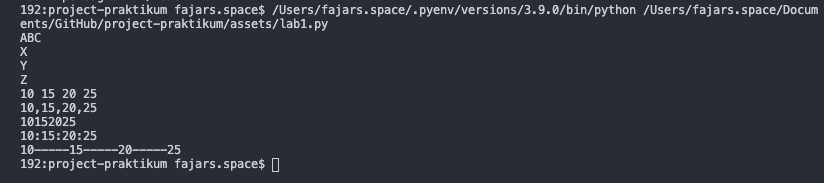
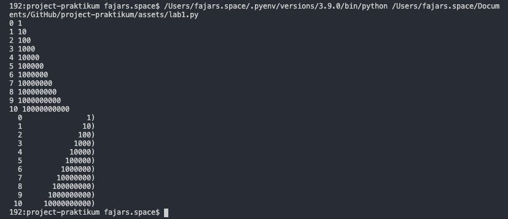
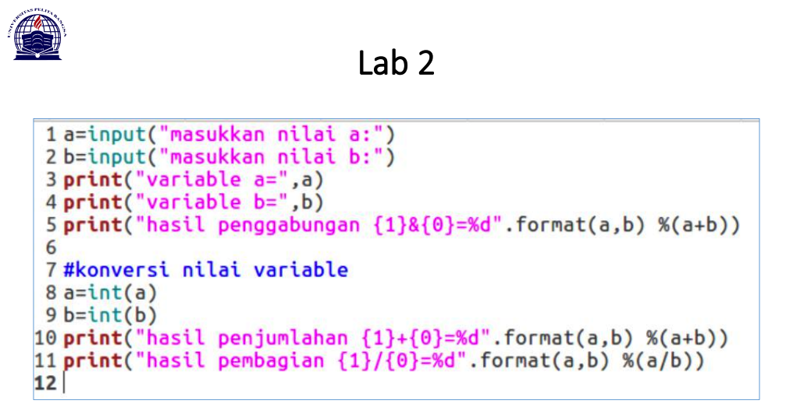
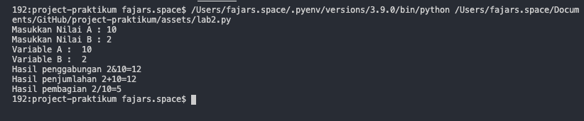
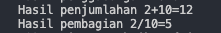

# Tugas untuk memenuhi pertemuan ke 6
## Pertemuan 5 - Latihan
Buatlah program untuk menginputkan biodata terdiri dari nama lengkap, nama panggilan, NPM, tempat lahir, tanggal lahir, telepon, alamat.

berikut [source code](assets/tugas-5.py) nya:

```
namalengkap = input("Please enter your full name : ") 
namapanggilan = input("Please enter nickname : ")  
npm = int(input("Please enter your NPM : "))
tempatlahir = input("Please enter place of birth : ") 
umur = int(input("Please enter year of birth : "))
alamat = input("Please enter your address : ") 
telepon = int(input("Please enter your phone number : "))

print("\n\n Assalamu'alaikum. ")
print("\n Let me introduce my self, my name is", namalengkap , "but you can call me", namapanggilan , "my NPM", npm , "I was born in", tempatlahir , "and iam", umur , "years old, I am very glad if you want to invite my house in", alamat , "So, don't forget to call me before with the number", telepon , "\n\n Thank you ")
```
Hasil nya:



Penjelasan:
```
namalengkap = input("Please enter your full name : ")
```
* syntax diatas digunakan untuk mengambil input data, dengan kata lain saya ingin mengisi variabel 'namalengkap' dengan inputan data dari user, sehingga nanti bisa kita panggil dengan perintah ``print()``

```
npm = int(input("Please enter your NPM : "))
```
* syntax diatas juga sama, digunakan untuk mengambil input data, tapi sebelum tag 'input' saya menambahkan 'int' untuk menginput data khusus integer, jadi tipe data manapun tidak bisa di inputkan selain integer

```
print("\n Let me introduce my self, my name is", namalengkap)
```
* print berfungsi untuk mencetak hasil / output & saya juga memasukan variabel 'namalengkap' yang nanti akan tercetak setelah di inputkan oleh user

## Pertemuan 6 - Lab 1

[source code lab 1](assets/lab1.py):
```
#Penggunaan End
print("A", end="")
print("B", end="")
print("C", end="")

print()
print("X")
print("Y")
print("Z")

#Penggunaan Separator
w,x,y,z=10,15,20,25
print(w,x,y,z)
print(w,x,y,z,sep=",")
print(w,x,y,z,sep="")
print(w,x,y,z,sep=":")
print(w,x,y,z,sep="-----")
```


Penjelasan:
* Penggunaan END digunakan untuk menambahkan kata yang dicetak di akhir baris
* Penggunaan separator berfungsi sebagai tanda pemisah antar objek yang dicetak. Defaultnya adalah spasi

```
# string format 1
print(0, 10 ** 0)
print(1, 10 ** 1)
print(2, 10 ** 2)
print(3, 10 ** 3)
print(4, 10 ** 4)
print(5, 10 ** 5)
print(6, 10 ** 6)
print(7, 10 ** 7)
print(8, 10 ** 8)
print(9, 10 ** 9)
print(10, 10 ** 10)

# string format 2
print('{0:>3}{1:>16})'.format(0, 10 ** 0))
print('{0:>3}{1:>16})'.format(1, 10 ** 1))
print('{0:>3}{1:>16})'.format(2, 10 ** 2))
print('{0:>3}{1:>16})'.format(3, 10 ** 3))
print('{0:>3}{1:>16})'.format(4, 10 ** 4))
print('{0:>3}{1:>16})'.format(5, 10 ** 5))
print('{0:>3}{1:>16})'.format(6, 10 ** 6))
print('{0:>3}{1:>16})'.format(7, 10 ** 7))
print('{0:>3}{1:>16})'.format(8, 10 ** 8))
print('{0:>3}{1:>16})'.format(9, 10 ** 9))
print('{0:>3}{1:>16})'.format(10, 10 ** 10))
```


Penjelasan:
* string format 1 : menampilkan output berupa 2 outputan. sebelah kiri akan menampilkan angka urut dari angka 0 hingga 10, sedangkan sebelah kanan akan menampilkan Operasi Aritmatika Pangkat.
* string format 2 : ``print('{0:>3}{1:>16})'.format(0, 10 ** 0))`` ``.format()`` dalam kurung kurawal kita dapat menetapkan panjang bidang, rata kanan/kiri

## Pertemuan 6 - Lab 2

[source code lab 2](assets/lab2.py):

```
a=int(input("Masukkan Nilai A : "))
b=int(input("Masukkan Nilai B : "))
print("Variable A : ",a)
print("Variable B : ",b)
print("Hasil penggabungan {1}&{0}=%d".format(a,b) %(a+b))

#Konversi nilai variable
a=int(a)
b=int(b)
print("Hasil penjumlahan {1}+{0}=%d".format(a,b) %(a+b))
print("Hasil pembagian {1}/{0}=%d".format(a,b) %(a/b))
```


Penjelasan:
```
a=int(input("Masukkan Nilai A : "))
b=int(input("Masukkan Nilai B : "))
```
* syntax diatas untuk menginput nilai dalam variabel A & B, ``print("Hasil penggabungan {1}&{0}=%d".format(a,b) %(a+b))`` untuk mencetak nilai dengan menggabungkan dua variabel

```
#Konversi nilai variable
a=int(a)
b=int(b)
print("Hasil penjumlahan {1}+{0}=%d".format(a,b) %(a+b))
print("Hasil pembagian {1}/{0}=%d".format(a,b) %(a/b))
```
* mengkonversikan nilai variabel dengan penjumlahan & pembagian variabel A & B


<hr>
### how to
* auto push
```
sh deploy.sh
``
